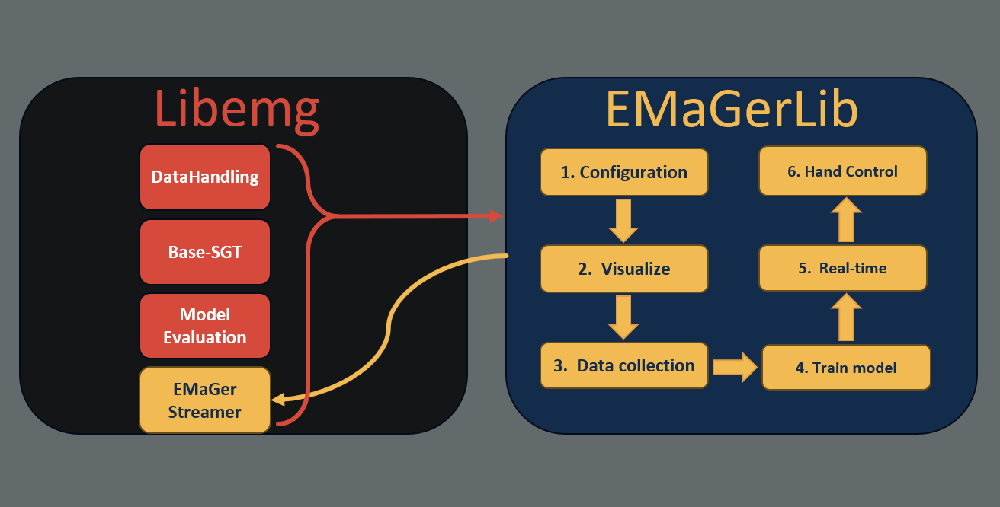
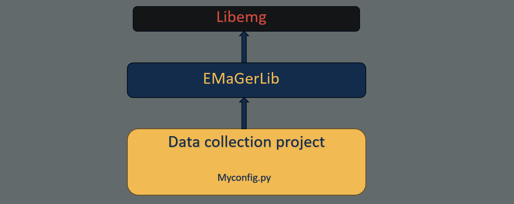

# emagerpy

[](https://opensource.org/licenses/MIT)
[](https://www.python.org/downloads/)

> **Note**: This project replaces the previous `emager-py` repository with improved architecture, enhanced features, and better maintainability.

A comprehensive toolbox for working with the EMaGer v1 and v3 EMG acquisition devices, featuring real-time gesture recognition and prosthetic hand control capabilities.

## Table of Contents

- [Overview](#overview)
- [Key Features](#key-features)
- [How It Works](#how-it-works)
- [Installation](#installation)
- [Quick Start](#quick-start)
- [Configuration](#configuration)
- [Available Commands](#available-commands)
- [Testing](#testing)
- [Development Workflows](#development-workflows)
- [Project Structure](#project-structure)
- [Documentation](#documentation)
- [Troubleshooting](#troubleshooting)
- [Contributing](#contributing)
- [License](#license)
- [Acknowledgments](#acknowledgments)
- [Citation](#citation)
- [Contact](#contact)

## Overview

**emagerpy** is a Python-based framework designed for electromyographic (EMG) signal processing, machine learning-based gesture recognition, and prosthetic hand control. Built on top of [libemg](https://github.com/libemg/libemg), it provides a complete pipeline from data collection to real-time control of prosthetic devices.

## Key Features

- **Real-time Gesture Recognition**: Advanced CNN-based models with quantization support for efficient inference
- **Prosthetic Hand Control**: Native support for Psyonic and other prosthetic hands via serial communication
- **Data Collection & Training**: Screen-guided training sessions with configurable gesture sets
- **Visualization Tools**: Real-time 64-channel EMG visualization and monitoring
- **Flexible Configuration**: Python, YAML, and JSON-based configuration system
- **EMaGer Hardware Support**: Compatible with EMaGer v1 and v3 devices

## How It Works

**emagerpy** provides a complete workflow from data collection to prosthetic control, built on top of [libemg](https://github.com/libemg/libemg) with custom extensions for EMaGer hardware.

<div align="center">
  
</div>

The library integrates with libemg's core components and our custom **EMaGer Streamer** to provide a 6-step pipeline: **Configuration → Visualize → Data Collection → Train Model → Real-time Prediction → Hand Control**. See the [Quick Start](#quick-start) section for details on each step.

### Architecture

<div align="center">
  
</div>

emagerpy sits between libemg (foundation) and your application. Simply import emagerpy and add your custom configuration.

## Installation

### Prerequisites

- Python >= 3.8
- Windows/Linux/MacOS
- EMaGer v1/v3 hardware (for real data acquisition)

### Quick Install

```bash
# Clone the repository
git clone https://github.com/SBIOML/emagerpy.git
cd emagerpy

# Install in development mode
pip install -e .
```

This installs the package with all dependencies and makes console commands available globally.

### Alternative: Manual Installation

```bash
pip install -r requirements.txt
```

> **Note**: For advanced installation options (development versions, forks, local builds), see the [Installation Guide](docs/INSTALLATION.md).

## Quick Start

> **Tip**: After installing with `pip install -e .`, you can use short console commands (e.g., `emager-screen-training`) or run scripts directly (e.g., `python examples/data_collection/screen_guided_trainning.py`).

> **Command-Line Arguments**: All commands support extensive configuration options. See the [CLI Guide](docs/CLI.md) for details.

### 1. Configure Your Setup

Copy the example configuration file [base_config_example.py](config_examples/base_config_example.py) to your project directory and modify it for your needs (paths, gesture classes, etc.).

More in [Configuration](#configuration) section. 

### 2. Visualize EMG Signals

Monitor real-time 64-channel EMG data:

```bash
emager-live-64ch
```

### 3. Data Collection

Run a screen-guided training session:

```bash
emager-screen-training
```

### 4. Train a Model

Train a CNN on collected EMG data:

```bash
emager-train-cnn
```

### 5. Real-time Prediction

Test gesture recognition in real-time:

```bash
emager-realtime-predict
```

### 6. Control a Prosthetic Hand

Run real-time control with a connected prosthetic:

```bash
emager-realtime-control
```

## Configuration

emagerpy uses a flexible configuration system supporting multiple formats:

- **Python (`.py`)** - Most flexible, allows code execution and computed values
- **YAML (`.yaml`)** - Human-readable, ideal for version control
- **JSON (`.json`)** - Machine-readable, good for automation (used for automatic config saving)

### Getting Started

1. **Copy the example configuration**: Use [base_config_example.py](config_examples/base_config_example.py) as a template
2. **Edit for your project**: Modify paths, gesture classes, and parameters
3. **Use with any command**:
   ```bash
   emager-train-cnn -c my_config.py
   ```

> **Note**: If you change path parameters (like `BASE_PATH` or `MEDIA_PATH`), update `.gitignore` accordingly to avoid committing large data files. See the [Configuration Guide](docs/CONFIGURATION.md) for details.

### Key Configuration Parameters

| Parameter | Description | Example |
|-----------|-------------|---------|
| `BASE_PATH` | Root directory for datasets | `Path("./Datasets/")` |
| `SESSION` | Session identifier | `"D1"` |
| `CLASSES` | Gesture class IDs | `[2, 3, 30, 14, 18]` |
| `WINDOW_SIZE` | EMG window size (samples) | `200` |
| `SAMPLING` | Sampling rate (Hz) | `1010` |
| `MODEL_NAME` | Model filename (or `None` to auto-detect) | `None` |

### Learn More

- [Configuration Guide](docs/CONFIGURATION.md) - Complete configuration documentation
- [base_config_example.py](config_examples/base_config_example.py) - Python configuration template
- [base_config_example.yaml](config_examples/base_config_example.yaml) - YAML configuration template


## Available Commands

After installing with `pip install -e .`, the following commands are available system-wide:

| Command | Description |
|---------|-------------|
| `emager-screen-training` | Screen-guided data collection |
| `emager-train-cnn` | Train CNN model |
| `emager-realtime-predict` | Real-time gesture prediction |
| `emager-realtime-control` | Real-time prosthetic control |
| `emager-live-64ch` | Live 64-channel EMG visualization |
| `emager-test-hand` | Test hand control interface |
| `emager-test-psyonic` | Test Psyonic hand |
| `emager-test-wave` | Test hand wave gestures |
| `emager-visualize-libemg` | Visualize with libemg |
| `emager-run-tests` | Run complete test suite |

### Basic Usage

```bash
# Use default configuration
emager-train-cnn

# Use custom configuration
emager-train-cnn -c my_config.py

# With debug logging
emager-realtime-predict --log-level DEBUG

# Save configuration after run
emager-train-cnn --save-config-name experiment_01
```

> **Note**: All commands support the same set of command-line arguments for configuration, logging, and config saving. See the [CLI Guide](docs/CLI.md) for complete details.

## Testing

Run the complete test suite:

```bash
emager-run-tests
```

The test suite includes:
- Configuration system (loading/saving Python, JSON, YAML)
- Utility functions (majority voting, decimation)
- Model discovery and sorting
- Gesture definitions and constants

### Test Individual Components

```bash
# Test hand control
emager-test-hand

# Test Psyonic hand
emager-test-psyonic

# Visualize EMG signals
emager-live-64ch
```

## Project Structure

```
emagerpy/
├── emager_tools/           # Core library modules
│   ├── config/             # Configuration management
│   ├── control/            # Prosthetic hand control interfaces
│   ├── models/             # Neural network models (EmagerCNN)
│   ├── utils/              # Utility functions and helpers
│   └── visualization/      # Real-time GUI and plotting tools
├── examples/               # Executable scripts
│   ├── data_collection/    # Data collection scripts
│   ├── hand_control/       # Hand control tests
│   ├── realtime/           # Real-time prediction and control
│   ├── training/           # Model training scripts
│   └── visualisation/      # Visualization tools
├── config_examples/        # Example configuration files
├── tests/                  # Unit tests
└── docs/                   # Documentation
```

## Documentation

Comprehensive documentation is available in the `docs/` directory:

- [Configuration Guide](docs/CONFIGURATION.md) - Complete configuration system documentation
- [CLI Guide](docs/CLI.md) - Command-line arguments and usage examples
- [Development Guide](docs/DEVELOPMENT.md) - Contributing, extending, and modifying emagerpy
- [Installation Guide](docs/INSTALLATION.md) - Advanced installation options
- [Troubleshooting Guide](docs/TROUBLESHOOTING.md) - Solutions to common problems

## Development Workflows

### Using emagerpy as-is

**Best for**: Standard EMG projects with custom configurations only

Install emagerpy and use provided commands with your configuration. No code modification needed.

```bash
pip install -e .
emager-screen-training -c my_config.py
```

### Extending emagerpy

**Best for**: Adding new features (controllers, models, visualizations)

Clone and install in editable mode, then add custom modules:

```bash
git clone https://github.com/SBIOML/emagerpy.git
cd emagerpy
pip install -e .
```

Add your modules to:
- `emager_tools/control/` - New prosthetic interfaces
- `emager_tools/models/` - Custom models
- `emager_tools/visualization/` - Visualization tools
- `emager_tools/utils/` - Utility functions

### Modifying libemg Integration

**Best for**: Changing how emagerpy interacts with libemg

You can either:
- **Fork and clone libemg locally** and install it in editable mode, then install emagerpy on top
- **Modify emagerpy's wrapper code** in files that interact with libemg

For complete development guidelines, see the [Development Guide](docs/DEVELOPMENT.md).

## Troubleshooting

### Common Issues

**EMaGer device not detected**
- Check USB connection and drivers
- Verify device appears in system (Windows: Device Manager, Linux: `lsusb`)
- Try different USB ports

**Import errors after installation**
- Reinstall in editable mode: `pip install -e .`
- Check Python version: `python --version` (must be >= 3.8)
- Verify all dependencies are installed: `pip list`

**Model training crashes**
- Reduce `BATCH_SIZE` in config if out of memory
- Ensure sufficient training data collected
- Check log files for detailed error messages

**Real-time control lag**
- Reduce `WINDOW_SIZE` for faster response
- Close unnecessary applications
- Consider model quantization for performance

For comprehensive troubleshooting, see the [Troubleshooting Guide](docs/TROUBLESHOOTING.md). You can also check [GitHub Issues](https://github.com/SBIOML/emagerpy/issues) for known problems and solutions.

## Contributing

We welcome contributions! Whether it's bug reports, feature requests, or code contributions:

1. **Report bugs** via [GitHub Issues](https://github.com/SBIOML/emagerpy/issues)
2. **Request features** by opening an issue with the "enhancement" label
3. **Submit code** via pull requests (see [Development Guide](docs/DEVELOPMENT.md))

Before contributing code:
- Read the [Development Guide](docs/DEVELOPMENT.md)
- Run tests with `emager-run-tests`
- Follow existing code style
- Document your changes

## License

This project is licensed under the MIT License - see the [LICENSE](LICENSE) file for details.

## Acknowledgments

- Built on top of [libemg](https://github.com/libemg/libemg)
- Developed by the Smart Biomedical Microsystems Laboratory (SBIOML)

## Citation

If you use this software in your research, please cite:

```bibtex
@software{emagerpy2025,
  title = {emagerpy: EMG Signal Processing and Prosthetic Control Toolbox},
  author = {Michaud, Étienne},
  year = {2025},
  organization = {Smart Biomedical Microsystems Laboratory},
  license = {MIT}
}
```

## Contact

**Author**: Étienne Michaud  
**Email**: etmic6@ulaval.ca  
**Organization**: Smart Biomedical Microsystems Laboratory  
**GitHub**: [SBIOML/emagerpy](https://github.com/SBIOML/emagerpy)

---

**Need help?** Check the [documentation](docs/) or [open an issue](https://github.com/SBIOML/emagerpy/issues).
